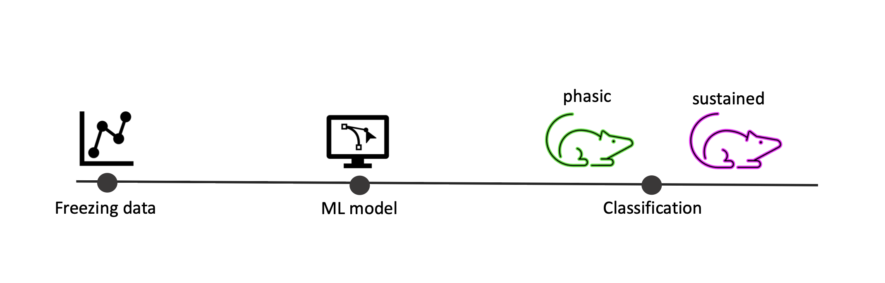

 

# FreezerClassifier
FreezerClassifier is an R package which can be used to predict behavioral endophenotypes after auditory aversive conditioning (AAC)[1]. Designed for the classification using the described experimental setup[1], FreezerClassifier can classify animals into sustained and phasic freezers using sex-specific machine-learning models. 

First, FreezingClassifier performs regression analysis, obtaining coefficients of a loglinear model for each individual freezing curve. These model coefficients are then used by sex-specifc machine-learning models to classify animals into sustained and phasic freezers. 

# Installation

# Usage 

# References 
